# Software Development Lifecycle — Inspire2Live Platform

> **How to view this document:** Open it in VS Code and press `Ctrl+Shift+V` to see all Mermaid diagrams rendered.  
> On GitHub the diagrams render automatically in the browser.

---

## Overview

This document describes the complete Software Development Lifecycle (SDLC) as it is
implemented in the Inspire2Live Platform project. The process is an **AI-assisted,
trunk-based, continuously-deployed** development model driven by a structured design
document, automated quality gates, and zero-friction deployment to Vercel + Supabase.

---

## 1 · High-Level Lifecycle

The lifecycle is a continuous loop of six phases. Every line of production code can be
traced from a requirement through design, implementation, testing, deployment, and back to
planning.

```mermaid
flowchart LR
    A(["🎯 Plan"]):::phase --> B(["🏗️ Design"]):::phase
    B --> C(["💻 Develop"]):::phase
    C --> D(["✅ Verify"]):::phase
    D --> E(["🚀 Deploy"]):::phase
    E --> F(["📊 Monitor"]):::phase
    F -->|"next iteration"| A

    A:::phaseA
    B:::phaseB
    C:::phaseC
    D:::phaseD
    E:::phaseE
    F:::phaseF

    classDef phaseA  fill:#4f46e5,stroke:#3730a3,color:#fff,rx:20
    classDef phaseB  fill:#7c3aed,stroke:#6d28d9,color:#fff,rx:20
    classDef phaseC  fill:#2563eb,stroke:#1d4ed8,color:#fff,rx:20
    classDef phaseD  fill:#059669,stroke:#047857,color:#fff,rx:20
    classDef phaseE  fill:#d97706,stroke:#b45309,color:#fff,rx:20
    classDef phaseF  fill:#dc2626,stroke:#b91c1c,color:#fff,rx:20
```



| Phase | Owner | Key Artefacts |
|-------|-------|---------------|
| 🎯 Plan | PM / Stakeholder | Design Doc, Work Package (WP) Definition, `MVP_SCOPE_AND_ROADMAP.md` |
| 🏗️ Design | Architect | ADR, `TRACEABILITY.md`, DB migration spec |
| 💻 Develop | Cline AI + Developer | Source files, unit tests, Supabase migration |
| ✅ Verify | GitHub Actions | CI pipeline — lint, typecheck, build, unit, E2E |
| 🚀 Deploy | Vercel + Supabase | Production URL, applied migration |
| 📊 Monitor | Developer / PM | `PLATFORM_AUDIT_REPORT.md`, `WP_STATUS.md` |

---

## 2 · Technology Stack

```mermaid
graph TD
    subgraph BROWSER["🌐  Browser"]
        direction LR
        UI["Next.js 15 · App Router\nTypeScript · Tailwind CSS\nReact Server Components"]
    end

    subgraph EDGE["⚡  Edge / Server"]
        direction LR
        MW["Middleware\n(route guard · role check)"]
        SA["Server Actions\n(mutations)"]
        API["Route Handlers\n(/api/version …)"]
    end

    subgraph SUPABASE["🗄️  Supabase (BaaS)"]
        direction TB
        AUTH["Auth\nMagic Link · OAuth"]
        DB["PostgreSQL\n22 migrations · RLS"]
        STORAGE["Storage\nAvatars · Evidence"]
    end

    subgraph CI["⚙️  CI / CD"]
        GHA["GitHub Actions\n3 jobs"]
        VERCEL["Vercel\nAuto-deploy on push"]
    end

    BROWSER -->|"RSC fetch"| EDGE
    EDGE -->|"supabase-js"| SUPABASE
    BROWSER -->|"supabase-js client"| AUTH
    AUTH -->|"JWT"| DB
    DB -->|"RLS policies"| STORAGE
    GHA -->|"quality gate"| VERCEL

    style BROWSER fill:#eff6ff,stroke:#3b82f6,color:#1e3a8a
    style EDGE    fill:#f0fdf4,stroke:#16a34a,color:#14532d
    style SUPABASE fill:#faf5ff,stroke:#9333ea,color:#4c1d95
    style CI      fill:#fff7ed,stroke:#ea580c,color:#7c2d12
```



---

## 3 · AI-Assisted Development Workflow

Cline (AI coding assistant) is the primary implementation agent. All work is done in
**PLAN → ACT** cycles that mirror a human pair-programming session.

```mermaid
sequenceDiagram
    actor PM  as 👤 PM / Developer
    participant DD  as 📄 Design Doc
    participant Cline as 🤖 Cline AI
    participant FS  as 🗂️ File System
    participant Git as 🐙 GitHub

    PM->>DD: Define requirement (REQ-xxx)
    PM->>Cline: Describe task in PLAN mode
    Cline->>FS: Read relevant files (context)
    Cline-->>PM: Present implementation plan
    PM->>Cline: Approve → switch to ACT mode

    rect rgb(239,246,255)
        Note over Cline,FS: ACT mode — autonomous implementation
        Cline->>FS: Write / edit source files (.tsx · .ts · .sql)
        Cline->>FS: Write Vitest unit tests
        Cline->>FS: Run pnpm test (all suites must pass)
        FS-->>Cline: ✅ Tests green
    end

    Cline->>Git: git add -A
    Cline->>Git: git commit -m "type(scope): message"
    Cline->>Git: git push origin main
    Git-->>PM: Push confirmed · CI triggered
```



### Cline git protocol (anti-hang rules)

| Rule | Rationale |
|------|-----------|
| Commit messages are **single-line only** | Multi-line `-m "..."` in PowerShell causes stdin hang |
| `git add`, `git commit`, `git push` run as **separate commands** | Never chain all three with `&&` |
| Use `scripts/git-push.ps1` for complex pushes | Wrapper script with per-step error checks |
| Always verify with `git log --oneline -1` | Confirms push landed |

---

## 4 · Continuous Integration Pipeline

Three GitHub Actions jobs run on every push to `main`, `develop`, or `release/**`.

```mermaid
flowchart TD
    TRIGGER(["🔀 Push / PR\nmain · develop · release/**"])

    TRIGGER --> QG

    subgraph QG ["🔒 Job 1 · Quality Gate  (always)"]
        direction TB
        Q1["Validate vercel.json"] --> Q2["pnpm install --frozen-lockfile"]
        Q2 --> Q3["ESLint"]
        Q3 --> Q4["TypeScript check\n(pnpm typecheck)"]
        Q4 --> Q5["Next.js Build\n(pnpm build)"]
        Q5 --> Q6[("Upload .next artifact")]
    end

    QG --> UT
    QG --> E2E

    subgraph UT ["🧪 Job 2 · Unit Tests  (parallel)"]
        direction TB
        U1["pnpm install"] --> U2["Vitest\n12 test files · 80+ assertions"]
        U2 --> U3[("Upload coverage\nretained 7 days")]
    end

    subgraph E2E ["🌐 Job 3 · E2E Smoke Tests  (main + release only)"]
        direction TB
        E1["Download .next artifact"] --> E2["Install Playwright Chromium"]
        E2 --> E3["auth.spec.ts\ndashboard.spec.ts"]
        E3 --> E4[("Upload report on failure\nretained 7 days")]
    end

    UT --> ALL_GREEN(["✅ All Green"])
    E2E --> ALL_GREEN
    ALL_GREEN --> DEPLOY(["🚀 Vercel auto-deploy"])

    style QG    fill:#eff6ff,stroke:#3b82f6
    style UT    fill:#f0fdf4,stroke:#16a34a
    style E2E   fill:#faf5ff,stroke:#9333ea
    style TRIGGER fill:#1e3a8a,color:#fff,stroke:#1e3a8a
    style ALL_GREEN fill:#059669,color:#fff,stroke:#047857
    style DEPLOY fill:#d97706,color:#fff,stroke:#b45309
```



### CI environment matrix

| Environment | Trigger | Supabase | E2E |
|-------------|---------|----------|-----|
| Local dev | `pnpm dev` | Local / remote | Manual |
| Vercel Preview | PR branch push | Production secrets | ❌ |
| Vercel Production | `main` push | Production secrets | ✅ |

---

## 5 · Database Migration Lifecycle

The PostgreSQL schema evolves through **sequential, numbered migrations** managed by the
Supabase CLI. Migrations are never edited after merge — schema changes always add a new
migration file.

```mermaid
timeline
    title Supabase Migration History (00001 → 00022)
    section 🏗️ Foundation
        00001 : Initial Schema
              : profiles · initiatives · tasks · milestones
        00002 : Row-Level Security Policies
        00003 : Storage Buckets (avatars · evidence)
        00004 : Database Views (health · pipeline · activity)
        00005 : Seed Data (roles · lookup tables)
    section 📦 Work Packages
        00006 : WP3 — Initiative Seed Data
        00007 : WP4 — Congress & Notifications
        00008 : WP5 — Resources & Partners
        00009 : Admin Bootstrap (first admin user)
        00010 : Schema Reconciliation
        00011 : Promote Admin utility
    section 🏛️ Congress Lifecycle
        00012 : Congress Full Lifecycle (states · transitions)
        00013 : Congress Assignments (roles in congress)
        00014 : Congress Workspace Tables (workstreams · RAID · tasks)
        00015 : Activity Log
        00016 : Chat Thread Types (message channels)
    section 📖 Features & Governance
        00017 : Patient Stories (create · review · publish)
        00018 : Patient Stories — Policy Fix (RLS)
        00019 : Moderator Governance
        00020 : Multi-Role Active Context
        00021 : PostgREST Schema Reload
        00022 : Permission System (space × role matrix)
```



### Migration rules

- **Never modify** a committed migration — add a new one instead
- File name format: `NNNNN_short_description.sql`
- Every migration must be idempotent (safe to replay)
- Seed data lives in `supabase/seed.sql` (dev) and `supabase/seed-demo.sql` (demo)

---

## 6 · Permission & Role Access Model

The platform uses a **4-tier permission system** combining role defaults with per-user,
per-space database overrides.

```mermaid
flowchart TD
    REQ(["🌐 Incoming Request"])

    REQ --> MW["⚙️ Middleware\nroute guard · redirect logic"]
    MW --> RESOLVE["🔍 Resolve Active Role\nfrom profiles.role + session"]
    RESOLVE --> MATRIX["📋 ROLE_SPACE_DEFAULTS\n8 roles × 13 spaces\n(role-access.ts)"]
    MATRIX --> DB{{"💾 DB Override?\nuser_space_permissions"}}

    DB -- "No override" --> DEFAULT["Use role default\n(invisible / view / edit / manage)"]
    DB -- "Global override" --> GLOBAL["Apply global override\n(affects all spaces)"]
    DB -- "Scoped override" --> SCOPED["Apply scoped override\n(space-specific · highest wins)"]

    DEFAULT & GLOBAL & SCOPED --> LEVEL["🎯 Effective AccessLevel"]

    LEVEL --> NAV["🧭 Side Nav\nhides invisible spaces"]
    LEVEL --> PAGE["📄 Page\nrenders or returns 403"]
    LEVEL --> ACTION["⚡ Server Action\nchecks before DB write"]

    style REQ     fill:#1e3a8a,color:#fff,stroke:#1e3a8a
    style LEVEL   fill:#059669,color:#fff,stroke:#047857
    style DB      fill:#7c3aed,color:#fff,stroke:#6d28d9
    style NAV     fill:#eff6ff,stroke:#3b82f6
    style PAGE    fill:#eff6ff,stroke:#3b82f6
    style ACTION  fill:#eff6ff,stroke:#3b82f6
```



### Role definitions

| Role | Description | Default spaces |
|------|-------------|----------------|
| `super_admin` | Platform owner | All (manage) |
| `admin` | Organisation admin | All (manage) |
| `board_member` | Board governance | Board + Congress + Initiatives |
| `bureau_member` | Operations | Bureau + Congress + Initiatives |
| `researcher` | Research contributor | Initiatives + Resources |
| `partner` | External partner | Partners + Public |
| `patient_advocate` | Patient representation | Stories + Congress (view) |
| `public` | Unauthenticated / guest | Public pages only |

---

## 7 · Branching & Release Strategy


| Branch pattern | Purpose | CI jobs |
|----------------|---------|---------|
| `main` | Production · always deployable | Quality + Unit + E2E |
| `develop` | Integration branch | Quality + Unit |
| `release/**` | Hotfix / release prep | Quality + Unit + E2E |
| Feature branches | Not enforced yet (trunk-based) | — |

---

## 8 · Commit Convention & PR Process

### Commit message format

```
type(scope): short imperative description

Types:  feat | fix | ux | docs | refactor | test | chore | migration
Scopes: congress | initiatives | auth | nav | ui | admin | stories | cline | vercel | db
```

**Examples:**
```
feat(congress): add workspace RAID log table
fix(auth): resolve magic-link redirect loop
migration(db): add multi-role active context (00020)
chore(cline): update git-push script and CLINE_WORKFLOW rules
```

### PR checklist (from `.github/pull_request_template.md`)

- [ ] Maps to a requirement: `REQ-xxx`
- [ ] TypeScript compiles clean (`pnpm typecheck`)
- [ ] RLS / permission impact reviewed
- [ ] Traceability matrix updated (`docs/TRACEABILITY.md`)
- [ ] Screenshots attached for UI changes
- [ ] ADR filed if architecture deviates from design document

---

## 9 · Tooling Reference

| Tool | Role | Config file |
|------|------|-------------|
| **Next.js 15** | Full-stack React framework | `next.config.ts` |
| **TypeScript** | Type safety | `tsconfig.json` |
| **Tailwind CSS** | Utility-first styling | `postcss.config.mjs` |
| **Supabase** | Auth · DB · Storage | `supabase/config.toml` |
| **pnpm** | Package manager | `pnpm-workspace.yaml` |
| **Vitest** | Unit test runner | `vitest.config.ts` |
| **Playwright** | E2E test runner | `playwright.config.ts` |
| **ESLint** | Static analysis | `eslint.config.mjs` |
| **GitHub Actions** | CI/CD orchestration | `.github/workflows/ci.yml` |
| **Vercel** | Hosting · Edge CDN | `vercel.json` |
| **Cline** | AI coding assistant | `.clinerules` (implicit) |
| **scripts/git-push.ps1** | Safe commit + push wrapper | — |

---

## 10 · Cross-Document Index

See `docs/README.md` for the full categorized documentation index.

| Document | Content |
|----------|---------|
| `docs/README.md` | **Documentation index** — start here |
| `docs/MVP_SCOPE_AND_ROADMAP.md` | Work Package definitions and delivery milestones |
| `docs/TRACEABILITY.md` | Requirement → ADR → code → test mapping |
| `docs/IMPLEMENTATION_GUIDE.md` | Detailed coding patterns and conventions |
| `docs/CLINE_WORKFLOW.md` | Cline git protocol and no-hang rules |
| `docs/TEST_STRATEGY.md` | Test philosophy, coverage goals, risk map |
| `docs/RELEASE_PROCESS.md` | Versioning, deployment, hotfix, rollback |
| `docs/SECURITY_AND_PRIVACY.md` | GDPR compliance, data handling, security controls |
| `docs/INCIDENT_RESPONSE.md` | Severity levels, escalation, rollback runbook |
| `docs/MONITORING.md` | Observability, alerting, log access |
| `docs/ENVIRONMENT_REFERENCE.md` | Every env variable explained |
| `docs/ROLE_PERMISSION_MODEL.md` | Full role × space permission matrix |
| `docs/DATA_DICTIONARY.md` | Database schema reference |
| `docs/PLATFORM_AUDIT_REPORT.md` | Full audit of platform state against design |
| `docs/WP_STATUS.md` | Current WP delivery status |
| `docs/DESIGN_CHANGELOG.md` | Design decisions and deviations log |
| `docs/ADR/` | Architecture Decision Records (5 ADRs) |
| `CHANGELOG.md` | Release history (semver) |
| `supabase/migrations/` | Sequential DB schema history |

---

*Last updated: 2026-02-23 · Maintainer: Michael Wittinger*
